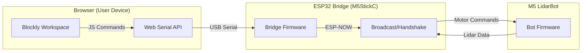

# 🤖 LidarBotWeb: Blockly Remote Control

[](https://opensource.org/licenses/MIT)
[](https://www.typescriptlang.org/)
[](https://developers.google.com/blockly)
[](https://www.espressif.com/en/products/software/esp-now/overview)

> **LidarBotWeb** is a high-performance web-based visual programming environment for the **M5 LidarBot (v1)**. It bridges the gap between simple browser logic and real-world robotics using an ESP32 bridge and the Web Serial API.


---

## 🏗️ Architecture & Communication

The system follows a three-tier communication chain to ensure low latency and reliable control:



1.  **Web App:** Provides an i18n-enabled Blockly editor. It sends serial strings (e.g., `50,0,0`) to the bridge.
2.  **ESP32 Bridge:** Acts as a gateway. It converts Serial commands to the ESP-NOW protocol and receives real-time Lidar data back from the robot.
3.  **LidarBot:** Receives joystick-like vectors and executes them on the mecanum wheels. It sends back a 180-byte Lidar packet (45 points) for visualization.


---

## ✨ Key Features

-   **🧩 Visual Programming:** Fully customized Blockly environment with categories for **Movement**, **Lights**, **Sensing**, **Logic**, and **Math**. Includes advanced UI features like an intuitive color picker block.
-   **⚡ Real-Time Lidar Visualization:** Bridge translates Lidar data onto the Serial port for browser-side processing. Features an interactive Lidar View with precise Pan and Zoom capabilities.
-   **🌍 i18n Support:** Fully translated UI and Block labels for **English** and **German**.
-   **💾 Auto-Persistence:** Your Blockly workspace is automatically saved to LocalStorage.
-   **🚨 Emergency Stop:** Integrated emergency stop via M5StickC Button A or UI command.
-   **🔗 Auto-Pairing:** Smart handshake protocol to connect the bridge to the robot automatically.


---

## 🚀 Getting Started

### 1. Requirements
-   **Hardware:**
    -   M5 LidarBot (v1)
    -   M5StickC or M5StickC PLUS as the Bridge
    -   USB-C Cable
-   **Software:**
    -   Chrome or Edge (supporting [Web Serial API](https://developer.mozilla.org/en-US/docs/Web/API/Web_Serial_API))

### 2. Bridge Setup
1.  Open the `firmware-bridge/` folder in Visual Studio Code.
2.  Use the [PlatformIO](https://platformio.org/) extension to build and flash the firmware to your M5StickC.
3.  The device should show **"Bridge Ready"** on its display.

### 3. Web App Setup
```bash
cd webapp
npm install
npm run dev
```
1.  Navigate to `http://localhost:5173`.
2.  Click **"Connect"** and select the ESP32 bridge's COM port.
3.  Wait for the **Robot** status to turn green (ensure LidarBot is switched on).

---

## 📂 Project Structure

```text
LidarBotWeb/
├── .agent/              # Agent skills and knowledge base
├── firmware-bridge/            # ESP32 Bridge Firmware
│   ├── src/
│   │   └── main.cpp     # Bridge logic (Serial <-> ESP-NOW)
│   └── platformio.ini   # Build configuration
├── firmware-lidarbot/            # ESP32 LidarBot Firmware
│   ├── src/
│   │   └── main.cpp     # LidarBot logic (ESP-NOW <-> Motor/Lidar)
│   └── platformio.ini   # Build configuration
└── webapp/              # Web Application (Vite + TS)
    ├── src/
    │   ├── blockly/     # Block definitions & generators
    │   ├── i18n.ts      # Multi-language system (EN/DE)
    │   ├── lidarStore.ts# Reactive Lidar state
    │   ├── serial.ts    # Web Serial management
    │   └── main.ts      # UI Orchestration
    └── index.html       # Entry page
```

---

## 🛠️ Development Workflows

We use specialized agent workflows to maintain code quality:

-   **`/firmware-upload`**: Automates flashing and verification of the ESP32.
-   **`/web-testing`**: Runs automated tests for the Blockly blocks and UI.

### 🧠 Agent Skills
-   **ArchitectureAnalyzer**: Detailed map of communication flows.
-   **CodeQualityAuditor**: Ensures consistency across the codebase.
-   **FirmwareDeveloper**: Expert on ESP32/esp-idf/Arduino.
-   **ProtocolExpert**: Deep dive into the custom Serial/ESP-NOW protocol.

---

## 📜 License
This project is licensed under the MIT License - see the `LICENSE` file for details.